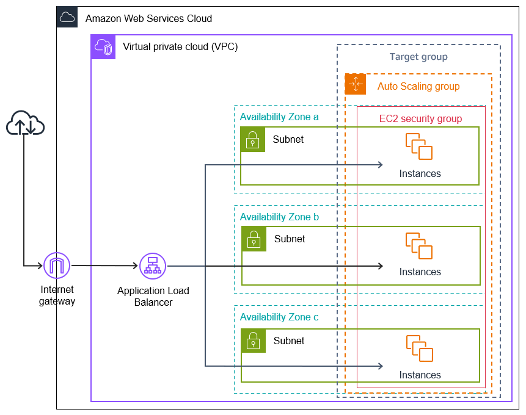

  <h1 style="font-size: 36px; color: #2F855A; font-weight: bold;">Auto Scaling and Load Balancer in AWS: A Step-by-Step Guide</h1>
  
Learn how to set up Auto Scaling and Load Balancer in AWS to handle variable traffic demands, ensuring high availability and fault tolerance.

## Overview

In this project, we will walk through how to implement **Auto Scaling** and **Load Balancer** in AWS to handle variable traffic demands, ensure high availability, and improve fault tolerance. The key AWS services we will use include:
- **Amazon EC2** (Elastic Compute Cloud)
- **Amazon ELB** (Elastic Load Balancer)
- **Auto Scaling Groups**

This guide will help you set up an environment that scales your application based on traffic and load, ensuring consistent performance during peak and off-peak hours.

---

## Table of Contents
1. [Prerequisites](#prerequisites)
2. [Architecture Diagram](#architecture-diagram)
3. [Step 1: Create an EC2 Instance](#step-1-create-an-ec2-instance)
4. [Step 2: Create a Load Balancer](#step-2-create-a-load-balancer)
5. [Step 3: Configure Auto Scaling](#step-3-configure-auto-scaling)
6. [Step 4: Test the Auto Scaling and Load Balancer](#step-4-test-the-auto-scaling-and-load-balancer)
7. [Conclusion](#conclusion)

---

## Prerequisites

- AWS Account
- Basic knowledge of EC2 instances, Load Balancers, and Auto Scaling in AWS.
- AWS CLI installed and configured.
- AWS Free Tier or sufficient credits to avoid unnecessary charges.

---

## Architecture Diagram

  
  
Diagram: Auto Scaling and Load Balancer in AWS

---

## Step 1: Create an EC2 Instance

1. **Log into AWS Management Console** and navigate to **EC2**.
2. Select **Launch Instance**.
3. Choose an **Amazon Linux 2** or **Ubuntu Server** AMI (Amazon Machine Image).
4. Choose the **t2.micro** instance type for testing (or another instance type as per your needs).
5. Configure **Security Groups** to allow HTTP (80) and SSH (22) access.
6. Create a **key pair** to access the instance via SSH.
7. Review and **Launch** the instance.

---

## Step 2: Create a Load Balancer

1. **Go to the EC2 Dashboard** and click on **Load Balancers** in the sidebar.
2. Click **Create Load Balancer** and select **Application Load Balancer**.
3. Provide a name for the Load Balancer (e.g., `MyApp-ALB`).
4. Choose **Internet-facing** and select the **VPC**.
5. Set up listeners to forward traffic on HTTP (port 80).
6. Create a **Target Group** (e.g., `MyTargetGroup`) and select your EC2 instance.
7. Review and **Create** the Load Balancer.

---

## Step 3: Configure Auto Scaling

1. **Go to the EC2 Dashboard** and click on **Auto Scaling Groups**.
2. Click **Create Auto Scaling Group**.
3. Choose an **EC2 Launch Template** or **Launch Configuration**.
   - For simplicity, you can select the EC2 instance created in Step 1.
4. Set the **Desired Capacity**, **Minimum Capacity**, and **Maximum Capacity** (e.g., 1-3 instances).
5. Attach the **Target Group** created in Step 2 to the Auto Scaling Group.
6. Configure **Scaling Policies** based on metrics (e.g., CPU utilization) to trigger scaling.
7. Review and **Create** the Auto Scaling Group.

---

## Step 4: Test the Auto Scaling and Load Balancer

1. Open your Load Balancer’s **DNS name** in a browser. You should see your application running.
2. Simulate traffic by opening multiple browser windows or use a load testing tool like **Apache JMeter** to increase traffic.
3. Monitor the **Auto Scaling Group** and ensure that additional instances are launched automatically as the load increases.
4. Check that traffic is being distributed evenly across the EC2 instances through the **Load Balancer**.

---

## Conclusion

You have now successfully set up **Auto Scaling** and **Load Balancer** in AWS! Your application can now scale based on traffic demands, ensuring high availability and fault tolerance.

---

### Notes:
- You can adjust the Auto Scaling policy based on your application’s needs.
- Use **Amazon CloudWatch** to monitor the performance and scaling actions.
- For production environments, consider adding HTTPS listeners to your Load Balancer.

---

### Architecture Diagram:

 

  
AWS Auto Scaling and Load Balancer Diagram

---

### Adjust File Paths
Ensure that the image file (`aws-auto-scaling-load-balancer-diagram.png`) is located in the `images` directory in the root folder of your project for GitHub to render it correctly. Adjust the file path as necessary for your project structure.
