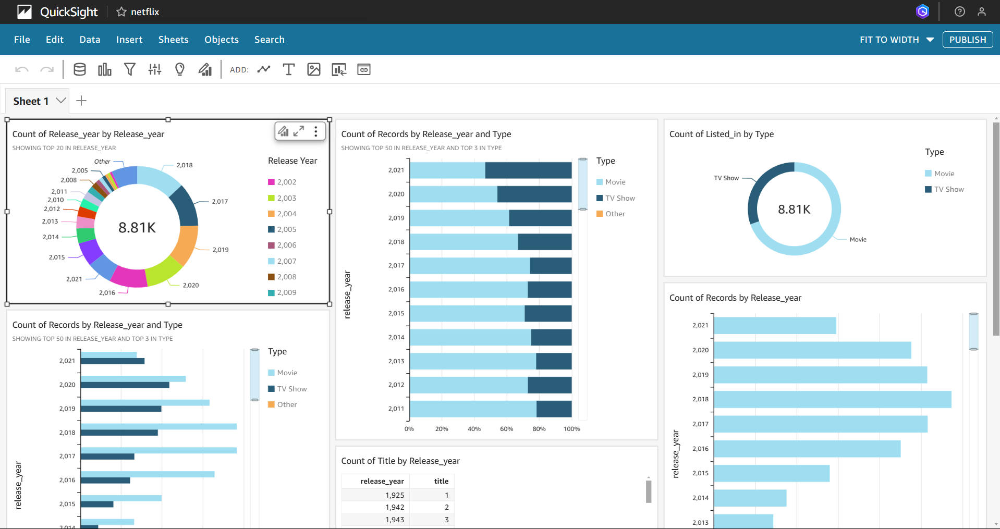

  <h1 style="font-size: 36px; color: #2F855A; font-weight: bold;">Visualize Netflix Data with Amazon QuickSight</h1>
  
Learn how to analyze Netflix data trends and create insightful dashboards using Amazon QuickSight in just 90-120 minutes!

---

## **Project Overview**

  <table style="border: 1px solid #ddd; border-collapse: collapse; width: 80%;">
    <tr>
      <th style="text-align: left; padding: 8px;">Difficulty</th>
      <td style="padding: 8px;">Easy</td>
    </tr>
    <tr>
      <th style="text-align: left; padding: 8px;">Time Required</th>
      <td style="padding: 8px;">90-120 Minutes</td>
    </tr>
    <tr>
      <th style="text-align: left; padding: 8px;">Cost</th>
      <td style="padding: 8px;">$0 (AWS Free Tier)</td>
    </tr>
    <tr>
      <th style="text-align: left; padding: 8px;">AWS Services Used</th>
      <td style="padding: 8px;">Amazon S3, Amazon QuickSight</td>
    </tr>
  </table>

---

## **Step-by-Step Guide**

### **1. Download the Dataset**
1. Download the following files:
   - `netflix_titles.csv`: Contains the Netflix data we will analyze.
   - `manifest.json`: Helps QuickSight understand and connect to your dataset.

---

### **2. Store the Dataset in Amazon S3**
1. **Create a New S3 Bucket:**
   - Name it `nextwork-quicksight-yourname` (replace `yourname` with your own name).
2. **Upload Files:**
   - Upload `netflix_titles.csv` and update the `manifest.json` file to include the S3 URL of the dataset.
   - Upload the updated `manifest.json` file into the same bucket.

---

### **3. Set Up Amazon QuickSight**
1. Sign up for a free trial of Amazon QuickSight (Enterprise Edition).  
2. **Important:** Uncheck the "Add Paginated Reports" option to avoid charges.
3. Ensure S3 permissions are granted to QuickSight.

---

### **4. Connect Your Dataset**
1. Go to the **Datasets** section in QuickSight.
2. Create a new dataset using S3 as the source:
   - **Source Name:** `kaggle-netflix-data`
   - **Manifest URL:** Add the S3 URL for the `manifest.json` file.
3. Fix any errors by verifying permissions, file formatting, and region compatibility.

---

### **5. Create Visualizations**
1. **First Visualization:**
   - Drag the `release_year` field to the **Y Axis** and create a **Donut Chart**.
2. **Second Visualization:**
   - Create a horizontal bar chart comparing `release_year` with `type`.
3. Continue adding new charts or tables as per the Netflix team’s requirements:
   - Stacked bar chart for TV shows and movies per release year.
   - A table showing the number of movies vs. TV shows per release year.
   - Analyze the largest number of additions by day.
   - Filter data by specific genres like 'Action & Adventure', 'TV Comedies', or 'Thrillers'.

---

### **6. Finishing Touches**
1. Edit chart titles for clarity.
2. Publish your dashboard and export it as a PDF.
3. **Bonus Challenge:** Update your dataset in S3 and refresh it in QuickSight to see the changes reflected.

---

## **Conclusion**

  
Congratulations! You've successfully visualized Netflix data using Amazon QuickSight. Share your dashboard and insights with others to showcase your data analysis skills!

  
Happy Visualizing! 🎉

